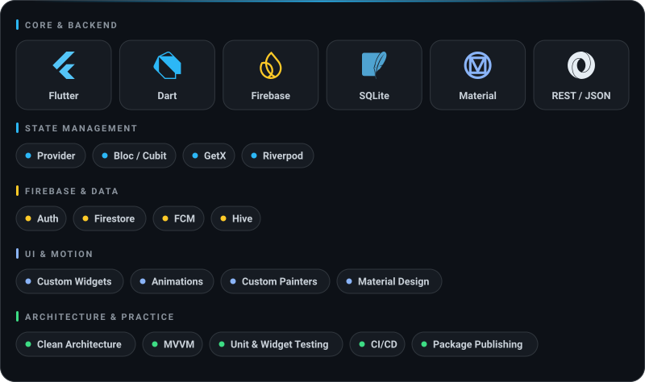
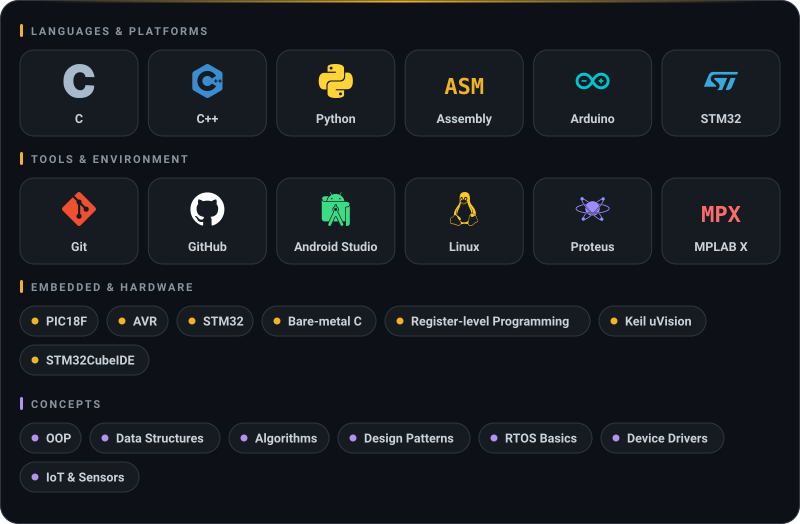

<div align="center">


</div>

<br/>

## 👨‍💻 About Me

```dart
class Youssef extends Developer {
  final String role = "Flutter Developer & Embedded Systems Engineer";
  final List<String> stack = ["Flutter", "Dart", "Embedded C", "Assembly"];
  final String focus = "Clean Architecture, State Management, IoT";
  final bool openToWork = true;

  @override
  String bio() => "Building smooth cross-platform apps in Flutter, "
                  "backed by a deep understanding of the hardware "
                  "they might one day talk to.";
}
```

- 📱 **Flutter & Dart:** responsive, well-architected mobile apps with clean state management and polished UI/UX.
- 🔌 **Embedded Systems:** PIC microcontrollers, bare-metal C/Assembly, Proteus simulation. I understand software from the hardware up.
- 🧱 **Leveling up:** Clean Architecture, Bloc / Provider / Riverpod, and API-driven app design.
- 🌱 **Growing in:** system design and IoT integration, connecting devices to the apps that control them.
- ⚡ I care about code that is clean, modular, and pleasant to maintain, from a widget tree to a register-level driver.

<br/>

## 📱 Mobile Development

<div align="center">
  
</div>

<br/>

## 🔌 Embedded & Engineering

<div align="center">
  
</div>

<br/>

## 📬 Let's Connect

<p align="center">
  <a href="https://www.linkedin.com/in/youssef-waheed-a40a77263"></a>&nbsp;&nbsp;
  <a href="mailto:wayoussef138@gmail.com"></a>&nbsp;&nbsp;
  <a href="https://github.com/Youssef-Wheed"></a>
</p>

<div align="center">

*"From widgets to registers, I build things that work, and work beautifully."*

</div>
